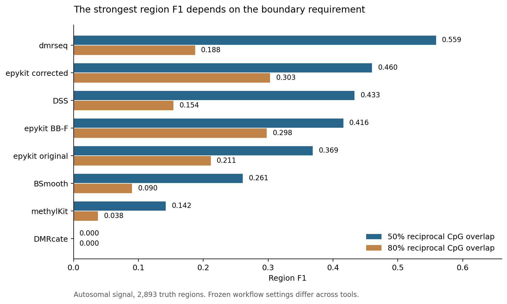
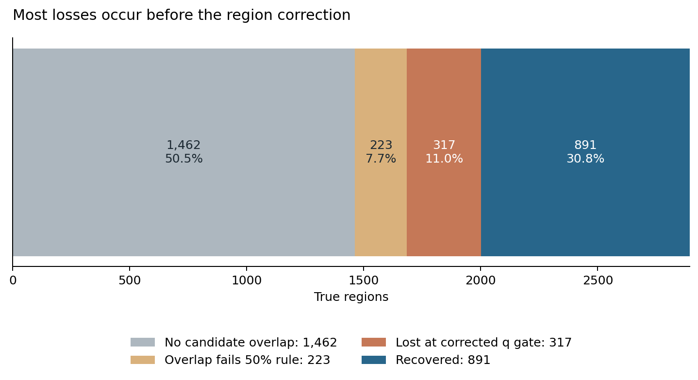
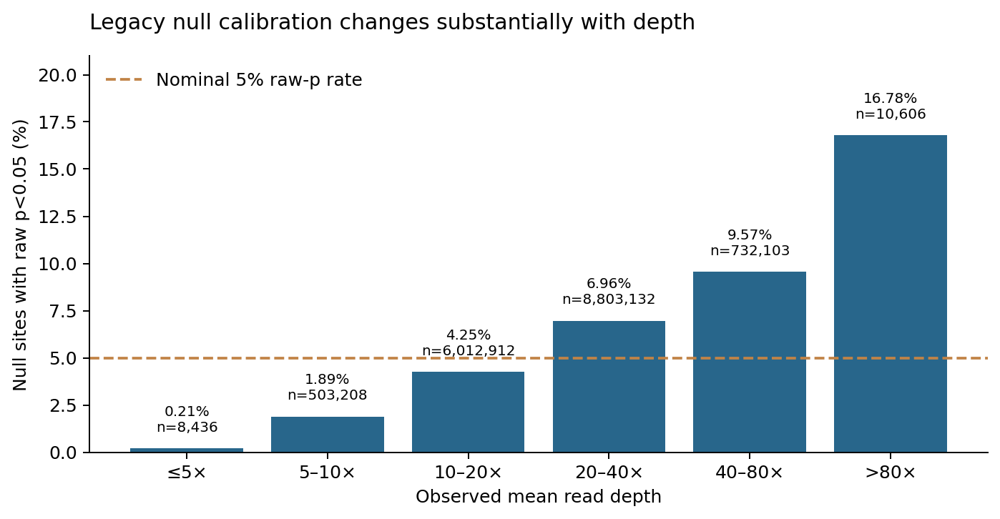
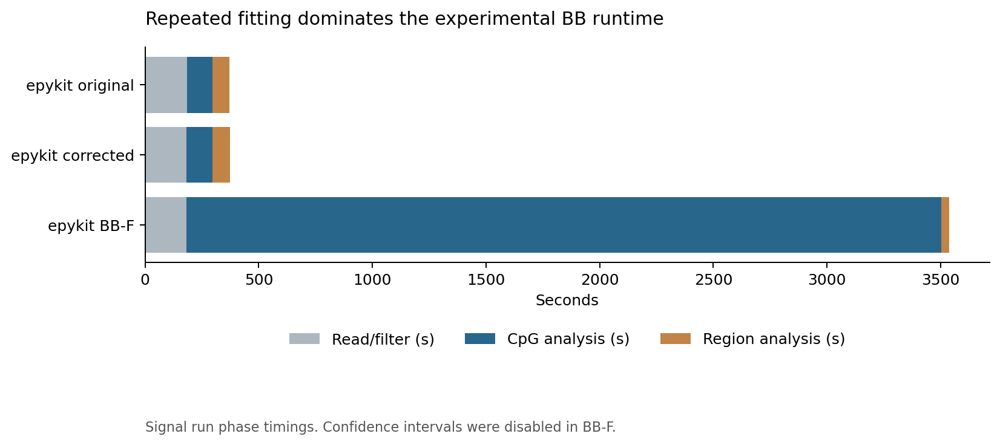

# Epykit is fast, but calibrated CpG inference and region detection still limit its power

Technical performance review · evidence available 9 October 2026

## Executive summary

Epykit's strongest asset is its fast, modest-memory workflow. The corrected legacy engine processes the autosomal signal dataset in **6.27 minutes at 6.14 GiB**, versus DSS at 50.18 minutes/22.40 GiB and dmrseq at 485.09 minutes/11.62 GiB. The region correction substantially improves the reliability of calls on this benchmark: precision rises from **33.2% to 90.9%**, region F1 from **0.369 to 0.460**, and null calls fall from **1,869 to zero**. This is a useful improvement, although one null run does not demonstrate general FDR control.

The remaining problem is statistical power at a defensible error rate. Corrected epykit recovers **30.8%** of true regions under 50% reciprocal CpG overlap, compared with **41.9%** for dmrseq. At stricter 80% overlap, corrected epykit has the highest F1 in this comparison, **0.303**, so the ranking depends on the boundary requirement. At the CpG level, legacy epykit identifies just **75 of 34,889 eligible true sites**, alongside **323 false sites**. A high region precision does not imply a good CpG engine.

The experimental count-likelihood beta-binomial engine improves CpG ranking but currently loses all site-level discovery power at BH q≤0.05. It calls **zero signal CpGs**, its minimum signal q-value is **0.937**, region recall falls to **26.9%**, and runtime increases to **58.99 minutes**. Keep this engine experimental. Merely choosing chi-square tails would produce smaller p-values without establishing their validity.

The recommended direction is to preserve the data-store architecture, improve dispersion and small-sample inference, and replace restrictive seed-driven region discovery with a model that borrows information across sites and accounts for selection. Low-risk numerical and I/O improvements can proceed independently. A complete spatial count-model rewrite is a credible research option; its benefit remains to be demonstrated on independent, correlated simulations and paired real data.

## 1. What the evidence can establish

The main comparison uses the completed **22-autosome GRCh38 signal and null simulations**, five biological replicates per group, nominal 20× depth, and 0.20 population methylation differences in signal regions. Library depths vary substantially: sample means range from about 4.63× to 35.62×. The catalogue contains 25,923,286 sites; the common coverage mask retains 16,070,989 signal sites. Of 54,619 true positive sites, only 34,889 are eligible: **36.1% of positive sites are excluded before testing**. There are 2,893 true regions.

These are fixed development datasets, already examined while developing the methods. The simulation disables spatial correlation. It is informative about depth, dispersion, multiplicity and synthetic region recovery, but cannot establish performance under realistic spatial dependence or independent biological validation. The matched signal/null pair shares some random streams and has slightly different final eligibility after count thinning; it is not two independent benchmark replications.

Three epykit versions are separated throughout: **original** means the frozen genome benchmark source; **region fix** changes complete-search region multiplicity while retaining the original CpG engine; **BB-F** is the experimental replicate-count likelihood with continuous log-dispersion shrinkage and an approximate F reference. Their source snapshots are the authoritative implementations. The current `/scratch/epykit3` checkout still matches the original relevant files; the reviewed improvements reside in `/scratch/epykit-calibration-fresh_20261007` and the result snapshots. A recommendation about the corrected engine is therefore not evidence that the original checkout has been updated.

The completed GSE64177 comparison includes all six tool families and all twelve samples. Epykit/DSS measurements are reused; the four other R tools were subsequently run without benchmark time/memory caps, with the documented methylKit unused-object cleanup. Their statistical settings are recorded. The original overall genome-baseline manifest is failed because its real-data workflow failed, although all its simulation tools completed. The later uncapped real run is complete. Reused timings and one execution per workflow support descriptive speed comparisons, not controlled estimates with confidence intervals.

The newer GSE263850 paper-aligned workflow is still running. DSS, epykit and DMRcate have completed with exit code zero; BSmooth was active at the captured cutoff, while methylKit and dmrseq were pending. Their completed measurements are shown as a separate partial real-study comparison. Its smoke results remain execution checks and are excluded. Pending caller outputs are not treated as zero.

## 2. Region accuracy, runtime and memory across tools

<!-- REGION_TABLE -->



Under the primary 50% overlap rule, dmrseq has the highest F1; corrected epykit comes second, ahead of DSS. Corrected epykit is approximately **8.0× faster than DSS and 77.4× faster than dmrseq**, with about **3.65× and 1.89× less sampled peak RSS**, respectively. BB-F gives almost the same region precision as the region fix, but lower recall and approximately **9.4× longer total runtime**.

The 80% rule changes the order: corrected epykit F1 is 0.303, BB-F 0.298, original epykit 0.211 and dmrseq 0.188. This supports a boundary-sensitive advantage on this input, not general superiority. Boundary errors are measured only among matched calls; a lower conditional error can also reflect a smaller selected set. Corrected epykit has 28 fragmented truth regions versus 78 originally, while dmrseq has 3. The scorer's fragmentation counts any overlapping calls, not only strict matches.

**Region “precision” here is strict matching precision.** A call that overlaps truth but fails the reciprocal boundary rule is unmatched; it is not necessarily a wholly false biological region. Original epykit has 2,137 calls with no positive eligible CpG, versus zero after the correction. The 89 unmatched corrected calls overlap some positive truth. These quantities should not be described interchangeably as biological FDP or expected FDR. Even dmrseq's zero complete-null calls does not prove 5% FDR control on this signal setting.

All tools saw the same count inputs and coverage mask, but native hypotheses and settings differ. Epykit is unsmoothed; DSS smooths. MethylKit uses 1 kb tiles for simulation DMRs; BSmooth uses native smooth-statistic segmentation; dmrseq uses region inference with permutations; DMRcate uses its native smoothed procedure. They are benchmarked **workflows**, not identical estimators at matched realized error rates. In particular, DMRcate's one unmatched signal region and zero null regions indicate little detection in this configuration, not an intrinsic inability of the tool to detect WGBS DMRs. Its native `pcutoff="fdr"` indexes the smoothed threshold by the number of individually significant CpGs; only one signal CpG is significant here. DSS uses `DMLtest(smoothing=TRUE, equal.disp=FALSE)` and raw-p `callDMR` at 10⁻⁵ with a three-CpG minimum and 100 bp merge distance; these are heuristic region calls, not native region q-values. BSmooth uses h=1,000 bp, ns=70 and |corrected statistic|≥4.6 with a 10% mean-effect requirement. Dmrseq uses a 10% candidate cutoff, five-CpG minimum, up to 100 permutations and region q≤0.05. MethylKit uses native MN overdispersion and BH; its 1 kb tiles are a particularly different boundary target. These settings help explain differences but their individual contributions were not isolated by reruns.

## 3. CpG detection: power and false discoveries must be read together

<!-- CPG_TABLE -->

The eligible signal prevalence is **0.217%**. Against that background, AUROC can look respectable while discovery precision is poor. Average precision is more informative for ranking: original/region-fix epykit is 0.0357, BB-F 0.0599 and DSS 0.3751. Ranking and calibrated threshold decisions remain distinct outcomes. BSmooth and dmrseq do not provide comparable per-CpG p/q outputs in this harness, so their site metrics are unavailable rather than zero.

Legacy epykit's **0.215% eligible-site recall and 81.2% observed FDP** are an unacceptable combination for a standalone CpG discovery claim on this input. DSS has much higher eligible recall, 69.7%, but also an observed FDP of 82.2% and 82,940 BH discoveries in the complete null. Its ranking advantage does not make its nominal q-values calibrated here. MethylKit's observed site FDP is 91.6%. DMRcate has one true site discovery, an insufficient basis for a reliable precision comparison.

BB-F has **no discoveries**, so discovery precision and FDP are undefined. The frozen scorer stores FDP=0 for an empty discovery set; this report displays a dash to avoid implying established error control. Its zero null calls accompany zero signal recall. The actual tails are revealing: the signal has 634,767 raw p<0.05 sites but **none below 10⁻⁵**; the minimum raw p is 2.24×10⁻⁵ and the minimum q is 0.937. In real data the minimum q is 0.962. These values show why adjusting the display or nominal BH cutoff modestly will not repair the engine.

The region correction's CpG TSVs are freshly verified **byte-identical** to the originals for signal, null and real data. It fixes region accounting only. It cannot be credited with improving site inference.

## 4. Real-data agreement and why published-region recovery is small

<!-- REAL_TABLE -->

Corrected epykit has **52/56 direction-concordant paper-overlapping calls**, but covers just **53/3,271 published regions (1.62%)**. BB-F covers 47, DSS 180, BSmooth 67, methylKit 28 and dmrseq 12. Dmrseq's 100% agreement fraction comes from twelve calls. Report both the fraction agreeing and the amount recovered; neither alone establishes biological accuracy.

At 50% reciprocal base-pair overlap, corrected epykit has 39 one-to-one matches, compared with 130 for DSS, 51 for BSmooth, 9 for dmrseq, 2 for methylKit and 0 for DMRcate. MethylKit's large fall from 28 any-overlap calls to 2 strict matches is consistent with its fixed-window boundaries being a poor match to short published intervals. This is a geometry comparison, not a measurement of latent truth.

The supplied paper list contains **2,479 regions with fewer than five CpGs** and **746 shorter than 50 bp**; only **733/3,271 (22.4%)** meet both the simple length and CpG-count thresholds. Corrected epykit requires five CpGs and 50 bp, while the source paper uses different detection criteria. These thresholds structurally constrain exact list reproduction. They are not a literal ceiling on overlap recovery: a longer called span can overlap a short paper region and contain additional flanking CpGs. Coverage eligibility also differs from the paper's catalogue.

GSE64177 contains six paired donors. The benchmark uses unpaired group models throughout. Ignoring pairing can leave donor variation in the residual noise and alter uncertainty; its impact on these calls has not been isolated. A future scientifically faithful comparison should use a donor term or an appropriate paired count model and paired resampling. The published list was itself generated using BSmooth and is not an independent truth set for comparing tools. Agreement should remain descriptive. [Pacis et al., original study](https://www.pai-lab.org/pdfs/pacis_2015.pdf).

### GSE263850: three completed callers, with a different profile

<!-- GSE_TABLE -->

This study has three heterozygous AKAP11-KO clones versus three WT replicates, hg38 strand-collapsed counts, and 813 published reference DMRs. The table contains only callers verified complete at capture; BSmooth, methylKit and dmrseq are unavailable at that cutoff. Epykit uses the corrected legacy engine with 500 bp count smoothing, raw seed p<10⁻⁵, zero minimum effect, four-CpG/51 bp minimum spans and a 100 bp merge limit. These results must not be combined numerically with the unsmoothed GSE64177 or autosomal defaults.

Epykit calls 51 regions in 2.79 minutes; 41 overlap the published list in the same direction, but only 15 meet the 50% reciprocal rule, representing **1.85% of the reference**. DSS has 659 strict matches (81.1% reference recovery); DMRcate has 27 (3.32%). These are paper-list agreement rates, not biological recall. The DSS profile uses the paper-aligned multifactor procedure, so agreement also reflects method compatibility; region significance, smoothing implementation and effective merge distances still differ.

The cached pre-q epykit output contains exactly **51 candidates, all of which pass BY q≤0.05**. The smoothed site output has 22,020,939 tested rows, 1,151 raw p<10⁻⁵ seeds and 145 BH-significant sites. Thus the final BY gate is not where region count is lost in this particular profile. Candidate generation, site-tail/dispersion modeling and boundary compatibility deserve priority. This observation does not isolate their individual contributions, and does not prove that smoothing itself caused or repaired the gap.

## 5. What the literature predicts before inspecting the implementation

**Depth and biological dispersion need separate treatment.** DSS models replicate counts using a beta-binomial distribution and shrinks dispersion; its official guide describes spatial smoothing as a way to improve mean estimates. This suggests investigating whether epykit's chromosome-level variance target fits heterogeneous depth and biological variability. Its documented multifactor fitting also motivates a donor-aware alternative. [DSS official guide](https://bioconductor.org/packages/release/bioc/vignettes/DSS/inst/doc/DSS.html).

**Spatial borrowing can increase precision, but affects boundaries and inference.** BSmooth estimates local methylation using neighbouring sites and biological replicates. Epykit's unsmoothed CpG calculations therefore face a different information budget. Smoothing is a hypothesis to test, not a justified default switch; short or abrupt effects can be diluted. [BSmooth original paper](https://link.springer.com/article/10.1186/gb-2012-13-10-r83).

**Region selection must be included in the statistical procedure.** Dmrseq detects regions de novo and uses permutation-based region inference with models of subject and inter-CpG variability. Its main relevance is the treatment of discovery and inference together, rather than a claim that its q-values must work on every simulator. [Dmrseq official repository](https://github.com/kdkorthauer/dmrseq), [original article](https://academic.oup.com/biostatistics/article/20/3/367/4899074).

**Small-sample tail approximations are a major power tradeoff.** MethylSig uses a squared-t approximation to the likelihood-ratio statistic at small sample sizes, and permits local information for means/dispersion. This gives precedent for investigating epykit's F approximation, but does not validate epykit's specific shrinkage estimator or degrees of freedom. [MethylSig original paper](https://pmc.ncbi.nlm.nih.gov/articles/PMC4147891/), [official manual](https://bioconductor.posit.co/packages/3.24/bioc/manuals/methylSig/man/methylSig.pdf).

These references motivate six testable hypotheses: incomplete region-search accounting; depth-mismatched dispersion shrinkage; excessively heavy or unjustified reference tails; lost power before candidate formation; repeated fitting as the BB computational cost; and coverage/geometry/design mismatches in real-paper comparisons. The next sections separate observations that confirm mechanisms from hypotheses whose contribution remains unresolved.

## 6. Confirmed mechanism: region-search accounting and its power cost

The original `dmr.py:call_dmr_chain_merge` selects significant/effect-qualified CpGs, determines boundaries from them, filters on length/CpG count/significant fraction, and combines raw site p-values. It then applies BH over the surviving selected regions. The denominator excludes the many other intervals that could have been chosen after observing the same data. This is an inferential problem, independent of speed.

The accepted `_region_search.py` correction counts all contiguous geometry-admissible intervals before reading effects/p-values, assigns unreported intervals p=1, and applies BY to the complete family. Fresh recalculation finds **776,121,901 eligible intervals** in the signal dataset, compared with **10,785 actual pre-q candidates**. The harmonic dependence factor is **21.047**. At the same candidate rank, the new multiplier `M×H(M)` is roughly **1.51 million times** the old selected-candidate BH denominator. This comparison describes correction arithmetic; it does not imply every individual q-value changes by that exact factor.

The observed gain is attributable to this change with unusually strong evidence: original and corrected CpG files are byte-identical; all 10,785 pre-q candidate boundaries, effects and raw combined scores are identical; only region accounting differs. Calls change from 3,623 to 980, matched calls from 1,202 to 891, and wholly unsupported calls from 2,137 to zero. The same 9,274 raw null candidates become zero reported null regions.

BY can accommodate overlapping hypotheses and selected reporting **if each fixed-interval p-value is valid**. It cannot fix site miscalibration or incorrect within-region covariance. This proviso is essential: the correction is a valuable guardrail, with a large power cost, not a complete calibration solution. [Benjamini–Yekutieli original result](https://doi.org/10.1214/aos/1013699998).

A useful improvement is a smaller **predefined** hypothesis family, such as externally specified regions or coordinate-only multiscale windows. It may improve power at the cost of resolution or missed novel boundaries. Defining the smaller family after looking at p-values recreates the original problem. Another route is discovery-aware region resampling, which retains flexible boundaries but costs computation and requires valid exchangeability.

## 7. Confirmed power bottleneck: most true regions never become matchable candidates

<!-- CANDIDATE_TABLE -->



For the legacy engine, the 2,893 true regions decompose as follows at 50% overlap: **1,462 have no overlap with any pre-q candidate; 223 have overlap but no qualifying reciprocal match; 317 have a qualifying pre-q candidate but lose it after complete-family correction; 891 are recovered.** There are no matching conflicts in this particular decomposition. Candidate detection limits recall to **41.76% before correction**, so improving multiplicity alone cannot recover the remaining 58.24% with the same boundaries.

The code explains why: seeds require raw p<0.05 and |observed methylation difference|≥0.10; chains join only consecutive seeds within 500 bp; endpoints are the first and last seed; spans require at least five CpGs, at least 50 bp and at least 50% seeds. The effect requirement applies to seed sites, **not the mean region effect**. Original epykit has 496 signal and 339 null called regions with mean absolute effect below 0.10. This is documented behaviour, not proof of a missing intended filter.

Seed endpoints naturally omit weak flanks. A large true region with patchy evidence can break into chains or fail the significant-fraction requirement. Nearby opposite-sign seeds can also enter the same chain; signed combination can cancel their evidence. Separating direction during discovery and splitting weak bridges are reasonable experiments, but each changes the search procedure and needs recalibration.

A separate truth-geometry diagnostic finds **369 truth regions with fewer than five eligible CpGs**, **156 whose eligible first-to-last span is below 50 bp**, and only **2,502/2,893** meeting both rules inside the exact truth span. A total of 310 have an internal eligible-site gap above 500 bp. These are explanatory morphology statistics, not a strict attainable-recall bound under reciprocal matching: calls can extend outside truth or select a contiguous subspan. The observed candidate ceiling is the direct measurement of current discovery loss.

BB-F generates 3,771 pre-q candidates and can match 1,169 true regions before correction (40.4%). Only 779 survive (26.9%). Its lack of BH-significant CpGs does not prevent DMR calls: chain_merge seeds raw p<0.05 and pools regional evidence, rather than requiring site q<0.05. Site and region discovery operate at different thresholds and statistical units.

## 8. Confirmed model mismatch: the legacy dispersion target depends on depth

The legacy `dmc.py:_run_lr` streams replicate-count sufficient statistics and computes pooled read-weighted group proportions. `_score_finalize` divides a binomial likelihood-ratio deviance by a Pearson scale estimate. The `eb` mode shrinks each site scale toward one chromosome-wide scale, after flooring scales at one. This is a quasi-binomial calculation, not a full beta-binomial likelihood.

For beta-binomial replicate counts, `Var(M)=N μ(1−μ)[1+(N−1)ρ]`. Biological dispersion ρ is distinct from the read-depth-dependent inflation factor. At equal depth N=10,20,80 and ρ=0.10, the corresponding inflation factors are **1.9, 2.9, 8.9**. Shrinking these toward one chromosome average can overinflate some low-depth sites and underinflate some high-depth sites, even when biological dispersion is identical. The original `eb` branch does not use the squared-depth accumulators; those are used by the optional `bb_site`/`bb_eb` variance mapping.



The benchmark symptoms agree with that mechanism: null raw-p rejection rates at 0.05 are **4.25% at 10–20×**, **6.96% at 20–40×**, **9.57% at 40–80×** and **16.78% above 80×**. In the signal benchmark, 317/323 epykit site false calls lie more than 1 kb from a true region; smoothing of boundaries cannot explain most of them. Of 239 null BH calls, 224 fall in the latent tau 0.2–0.5 stratum. In this simulator `ρ=tau/(1+tau)`; tau is not interchangeable with the package's ρ. Latent tau is diagnostic truth and must never be passed to inference.

The EB weight is computed from moments of **floored observed scale estimates**, `w=2(mean²/variance+2)`, and pseudo degrees of freedom are added to site residual df. Observed variance mixes real dispersion heterogeneity, finite-replicate estimation noise, depth variation and the floor. This is not demonstrated to be the posterior mean and reference df of a fitted count-level hierarchical model. An adjacent comment also reverses the relationship between observed variance and weight: the actual formula gives **less** shrinkage weight at larger variance, not more. The executable expression governs this review.

The depth association is strong supporting evidence for investigating this model, but it does not isolate how much of the false-call excess comes from depth weighting, shrinkage, reference approximation, boundaries or simulator mismatch. Re-estimate biological dispersion in a count likelihood, model depth explicitly, and validate the entire inference procedure on factorial depth/dispersion scenarios. The optional depth-aware moment engine is a useful ablation; earlier probes showed extreme tail conservatism, so it is not already a proven replacement.

## 9. Confirmed power risk: small-sample tails and conditional BB nuisance fitting

The original `_score_finalize` has comments about switching between chi-square and F. The actual `reference='adaptive'` branch assigns **F p-values for every site**, including scales floored at one. A historical df floor of 50 is also not the present behaviour: the benchmark source uses a numerical minimum of one. Recommendations based on those stale descriptions would target the wrong implementation.

BB-F is more restrictive: `_beta_binomial.py:test_lognormal` takes the fitted likelihood-ratio statistic to **F(1,n_valid−2)**, with eight denominator df for complete 5+5 sites. At statistic 30, F(1,8) gives **p=5.89×10⁻⁴**, compared with **4.32×10⁻⁸** from chi-square(1), a factor of about 13,642. For 16.07 million tests, the first BH rank requires roughly **3.11×10⁻⁹**. Higher ranks relax that threshold, but sparse effects and heavy tails make the extreme tail decisive. This is a mathematical contributor to low power, not proof that chi-square is calibrated.

The BB engine correctly uses replicate counts and fits group means with depth-aware biological variance. It learns a factorized mean×dispersion grid mixture from at most 4,096 replicate groups per chromosome, using two starts, then projects the dispersion mixture to a normal prior on log ρ. The within-site optimizer finds a **log-ρ MAP under separate group means**, then fits the null mean **holding that estimated ρ fixed**. This is a conditional LR comparison, not a full null/alternative profile or integration over dispersion uncertainty. Its F reference is an approximation; it does not become exact simply because the data likelihood is beta-binomial.

The model assumes a shared dispersion for both groups and a factorized mean/dispersion prior. The simulator learns dispersion by methylation-mean bins, so prior factorization is a substantive modeling restriction. On real chromosomes, alternative starts shift the fitted log-ρ centre by as much as **1.182** (3.26× on geometric ρ). All 70 prior optimizations converged, but convergence does not demonstrate identifiability or stable scientific calls. Projection also substitutes half the smallest positive grid point for the zero-dispersion state; a discrete binomial component is lost in scoring.

Held-out V3 simulations provide useful counterevidence to “the engine can never work”: the strong-effect setting recovers **83.0%** of true CpGs, and the more-replicate setting **31.7%**. Balanced and high-depth moderate-effect settings recover none at the tested threshold despite AP values 0.439 and 0.557. Nine repeated global-null runs have no BH rejection, but the 95% interval for the probability of any rejection extends to **33.6%**. This is limited calibration evidence, not demonstrated universal control. Earlier V2 validation was superseded after a sampling bug; it is not used here.

The main statistical development target is a coherent treatment of dispersion under the null and alternative, with a justified small-sample test or calibrated resampling. Candidate approaches include a moderated score/Wald test from a fitted count model, penalized null/alternative fits calibrated by simulation, or dispersion integration with quadrature/Laplace methods. They must be evaluated under mean-dependent dispersion, unequal group variances and missing coverage. Increasing estimated df or switching tails because a benchmark produces no calls is tuning, not justification.

## 10. Confirmed unresolved risk: within-region covariance is ignored

`dmr.py:_stouffer_combine_signed` converts each two-sided p-value to a signed normal score and divides their sum by `sqrt(sum(w²))`; chain_merge uses equal weights. It contains **no covariance term**. With correlated null scores, the correct variance is `wᵀΣw`. For k equal-weight sites with pairwise correlation c, it is `k[1+(k−1)c]`. For k=10 and c=0.2, the independence denominator understates the standard deviation by **√2.8≈1.67**. This is an illustrative model calculation, not an estimated correlation from these data.

BY controls dependence between valid interval p-values; it cannot correct an interval p-value whose own variance is wrong. The current simulation disables spatial correlation, so it does not settle this risk. Likewise, switching on count smoothing produces overlapping observations whose covariance must be reflected in region inference. The optional neighbour-combination routine produces separate `_combined` columns, while chain_merge reads the raw `pvalue` field; a power-stack switch does not automatically substitute those combined values into this caller.

Two practical alternatives are to estimate covariance from a suitable null/residual model and calibrate covariance-adjusted regional scores, or replay the **entire detection pipeline** under valid resampling. Covariance of methylation states cannot simply stand in for covariance of test statistics. The package's existing permutation path can be a starting point, but failed scans, self/mirror assignments, exchangeability, nuisance re-estimation and finite resampling uncertainty need explicit treatment.

For a paired study, shuffle labels within pairs or use an appropriate residual/model-based resampling scheme. With six pairs there are only 64 label assignments; a simple exact max-T p-value has resolution 1/64 and is a familywise-error approach, not automatically an efficient region-FDR estimator. For 5+5 samples there are 252 balanced assignments. Avoid pretending that 100 permutations provide arbitrarily precise extreme-tail calibration, or applying a second BH correction to an already scan-adjusted max-T p-value.

## 11. Computational diagnosis: repeated numerical fitting dominates BB-F

<!-- TIMING_TABLE -->



In the signal run, CpG analysis rises from **113.9 to 3,319.2 seconds**, a **29.1×** increase. It accounts for approximately **93.8%** of BB-F's measured phase time. Reading remains about 182 seconds; region analysis actually falls from 79.2 to 36.3 seconds because fewer candidates are generated. Total peak RSS remains about 6.1 GiB. This points to fitting computation as the main new cost; phase timing includes prior fitting, sorting, serialization and other DMC work, so it is not a function-level CPU profile of the full genome run.

The hotspot mechanism is clear in `_beta_binomial.py:_lognormal_batch`: for every site it scans 17 log-dispersion grid locations, brackets the best, performs up to 28 golden-section refinements, and repeatedly calls `_fit_mean` for both groups. Each mean fit has up to 60 safeguarded iterations with score/information and likelihood evaluations. On a bounded count-kernel probe, the outer search uses **47 objective evaluations per ordinary site**, corresponding to about 94 alternative group-mean fits, plus the final/null fits. These loops are already Numba compiled; blaming Python loops alone or rewriting the same algorithm in C++ is not an established solution.

Warm compiled probes on 5,000 independent synthetic sites with 5+5 replicates at 20× take **0.777 seconds** for continuous MAP versus **0.0305 seconds** for fixed known ρ (25.4×). At 80× those times are 2.187 and 0.0803 seconds. The fixed-ρ path performs a different inferential task and is **not** a replacement recommendation; the comparison isolates the cost of repeated nuisance fitting. Confidence intervals were disabled in the full BB benchmark, so they cannot explain that slowdown. The default API enables conditional profile intervals and will add further cost when requested.

There are also scaling limits outside the kernel. `_run_beta_binomial` allocates full chromosome×sample integer count matrices before processing 32,768-site batches; batching the fits does not bound the input matrices. `_dmc_stages.post_process` materializes the complete DMC table by default. `_apply_bh_to_store` collects a genome-wide p-value vector and sorting temporaries despite streaming other columns. Thus “streaming” is not an unconditional O(largest chromosome) end-to-end guarantee. Peak memory grows with sample count and total-site correction, even though current measurements are favourable.

Preserve the Parquet store and chromosome scheduling. Improve the optimizer using analytic derivatives or joint updates, warm starts and convergence-adaptive work; cache quantities independent of μ/ρ; benchmark special-function and stable log-likelihood branches before replacing them. Add site/block parallelism with a bounded thread/memory budget and prevent nested oversubscription. Use block-wise count loading after a bounded prior-training pass. Reduce repeated global materialization and use an exact disk-backed sort/correction if whole-genome multiple-testing memory becomes limiting. All optimizations need oracle comparisons for difficult boundary, zero-count and near-binomial cases; a faster wrong tail is not progress.

## 12. Prioritized improvements, from local changes to redesign

<!-- ROADMAP_TABLE -->

**First preserve the corrected fast workflow as the practical reference.** Its region results are the strongest demonstrated epykit tradeoff here. Fix stale comments, expose source/inference revisions, export genuine pre-q candidates separately, and report the seed/effect semantics clearly. Currently the runner file named `dmr_candidates.tsv` has already passed the public `tl.dmr` q-filter; the hidden native cache is required to reconstruct candidate loss. This obscures diagnostics. Do not present the original checkout as if it already contains the correction.

**Then separate statistical development from numerical optimization.** Dispersion modeling and test calibration should be designed together. Test single controlled changes—depth-aware scale, mean-dependent shrinkage, alternative reference and local borrowing—on matched simulations, comparing at common realized error levels. Keep the fast legacy engine, corrected search and experimental BB-F as frozen comparators. Prior starts, posterior width, boundary optima and coverage masks belong in an audit record.

**For better regions, prioritize discovery that sees weak coherent evidence.** Coordinate-only multiscale windows with calibrated region tests offer a relatively simple intermediate design. Discovery-aware resampling retains flexible boundaries. A spatial count model can unify estimation, detection and uncertainty. Merely loosening `pct_sig`, minimum CpGs or seed thresholds may increase recovery and false calls simultaneously. The previous exploratory original-q cutoff sweep reached F1≈0.515 at q=10⁻⁴ with eight null calls; it was selected on the same inspected data and is not a valid new default or a replacement for corrected multiplicity.

**For paired/covariate studies, add a scientifically appropriate count model.** The current BB engine explicitly rejects formulas, covariates and smoothing; the legacy GLM path is a separate model, not the same BB fit plus a donor term. Start with identifiable fixed donor/batch effects and calibrated contrasts. Random effects for kinship or repeated measurements should be added only for data that require them and with suitable cohort sizes.

A full rewrite of every library layer is not supported by these results. The data-store and public orchestration are useful assets. A new statistical backend can share their I/O/schema/provenance contracts while replacing the inference core. Measured kernel bottlenecks should determine whether compiled algorithm redesign is sufficient or a separate C++/Rust backend is worthwhile.

## 13. Two research directions inspired by the supplied summary

The supplied AI summary is an idea source, not benchmark evidence. Two primary works are relevant, but neither was run in this benchmark.

**Spatial count change points.** Hirt et al. propose a joint case/control methylome regime model with beta-binomial observations, particle filtering and smoothing, and decision rules for flexible differential signatures. It suggests replacing threshold chains with a model of coherent segments and uncertainty, including possible variance changes. Its linear-in-site complexity holds with algorithmic state/particle budgets fixed; constants, accuracy and storage still matter. Its error guarantees depend on model/parameter assumptions, and mean-or-variance or 99%-site regional hypotheses are different from this benchmark's mean-shift/reciprocal-overlap target. Implement an opt-in prototype with raw-count emissions and explicit null/alternative states, then compare it on matching hypotheses and spatially misspecified data. Epykit's current rule segmenter uses fixed Gaussian emissions on `meth_diff`; it is not this count-level model. [Hirt et al. preprint](https://arxiv.org/abs/2211.07311), [full paper](https://arxiv.org/pdf/2211.07311).

**Count mixed models.** MACAU includes covariates, kinship covariance and independent overdispersion in a binomial mixed model. Its reported 1.6× discovery gain is specific to baboon age-associated sites at 10% empirical FDR, not a promised gain for epykit. The primary article's augmentation uses auxiliary-mixture approximations, including negative-log-gamma mixtures; the summary's assertion that the original MACAU method is Pólya–Gamma Gibbs sampling is inaccurate. Borrow the modeling principle, then choose and validate a practical fitting strategy. Kinship is not established as a cause of poor performance in these independent synthetic samples. [Lea, Tung and Zhou, original MACAU article](https://journals.plos.org/plosgenetics/article?id=10.1371/journal.pgen.1005650).

The summary also incorrectly portrays dmrseq as requiring predefined genomic windows, groups several distinct methods into blanket FDR claims, and reverses common promoter/global cancer-methylation descriptions. Those assertions are not used in the diagnosis. A spatial prior does not create independent biological replication or automatically make missing-data inference reliable.

## 14. Validation needed before promoting a new default

Use new simulator seeds and keep the already-inspected genomes strictly as development references. Generate matched signal/null scenarios spanning biological replicate count, mean methylation, mean-dependent dispersion, unequal group dispersion, balanced/imbalanced depth, low coverage and dropout, and varying effect magnitude. Add realistic spatial correlation, abrupt and gradual boundaries, isolated DMCs, sparse CpGs, short/long regions, and variance-only changes whose detection target is explicitly separated from mean differences. For real data, include a paired analysis and an independent cohort; do not tune cutoffs to the published GSE64177 list.

Measure null-tail probabilities by depth/mean/dispersion stratum and uncertainty across **independent datasets**, not just millions of sites in one correlated dataset. Report the probability of any complete-null rejection separately from average FDP under alternatives. With zero failures, roughly 59 independent null trials are needed for a one-sided 95% binomial upper bound below 5%; this is an illustrative sample-size calculation for null rejection probability, not sufficient validation of FDR under alternatives. Include prior-start and permutation sensitivity.

Report CpG precision–recall curves/AP and recall at common observed FDP, as well as nominal-q outcomes. For regions, retain both 50% and 80% reciprocal matching, the fraction with no positive truth, covered-CpG precision/recall, fragmentation, merges and conditional boundary errors. A gain only in any-overlap counts can be boundary expansion rather than improved inference. Undefined metrics must remain undefined.

Benchmark ingestion, fitting, global correction, region selection and output separately on a pinned source/input environment. Record cold and warm JIT timings, repeated wall-clock measurements, peak process-tree RSS, cache reuse, thread budget and disk footprint. Show accuracy at fixed resources and resources at fixed error rates; a single F1-versus-runtime chart cannot settle every scientific use case.

Promotion should require reproducible calibration across the intended scenarios and useful detection at moderate effects, numerical equivalence for performance-only changes, and improved region recovery under relevant boundary rules. Set any performance/noninferiority margins before evaluating untouched data. The current evidence supports a development direction, not a new calibrated flagship default.

## 15. Evidence, source locations and reproducibility

This report recomputes metric arithmetic, confusion totals, paper overlap fractions, p-value tails, stage timing comparisons, complete-family BY values, source hashes, candidate matching ceilings and CpG byte equality. The bounded profiling script measures compiled kernels after warm-up. It does not claim a measured CPU share for every function in the full genome run. Original benchmark outputs and inference source were not changed.

Primary inputs are the frozen `genome_baseline`, `default_search_by_20261007`, `beta_binomial_20261007_full`, and completed `real_uncapped_20261008` results, plus a frozen partial GSE263850 comparison of verified completed callers. Supporting evidence includes V3 held-out count-model validation, CpG strata, boundary diagnostics, paper morphology and historical chr1–3 benchmarking. Historical chr1–3 epykit likewise has weak site recall (1.58%, FDP79.7%) and region F1 0.362 versus dmrseq 0.480; this supports recurrence across development inputs, not independent validation. Those data use an older simulation and cannot be pooled as replicates of the autosomal benchmark.

Source anchors below refer to the actual reviewed snapshots, not an assumed installed package version:

| Finding | Source anchor |
|---|---|
| Legacy pooled means, Pearson scale and EB moments | `results/genome_baseline/source_snapshot/epykit/dmc.py`, `_score_finalize`, lines 583–946 |
| Legacy actual F-reference branch | same file, lines 918–939 |
| Seed chains, endpoints, fraction/effect rules | `results/beta_binomial_20261007_full/source_snapshot/epykit/dmr.py`, `call_dmr_chain_merge`, lines 996–1091 |
| Independence-based signed combination | same file, `_stouffer_combine_signed`, lines 199–275 |
| Complete search count and selected BY | `results/beta_binomial_20261007_full/source_snapshot/epykit/_region_search.py`, lines 16–52 |
| BB whole-chromosome inputs and bounded fit batches | BB snapshot `dmc.py`, `_run_beta_binomial`, lines 1597–1640 |
| Repeated log-rho optimization, conditional null fit and F tail | BB snapshot `_beta_binomial.py`, lines 471–567 |
| Prior mixture, projection and group sampling | same file, lines 288–331 and 570–615 |
| Default materialization and global BH vector | BB snapshot `_dmc_stages.py:412–432`; `dmc.py:3123–3200` |
| Formula/smoothing limitations | BB snapshot `_dmc_config.py`, lines 90–101 |
| Fixed Gaussian segment emissions | BB snapshot `dmr_segment.py` and `_hmm.py:_gaussian_emission_logprob` |
| Simulation dispersion and spatial switch | `simulation/simulate.py:_counts`; `data/genome_autosomes_signal/manifest.json` |
| CpG universe and reciprocal matching semantics | `src/wgbs_v3/score.py:dml_metrics`, `dmr_metrics` |

Run the report diagnostics from the workspace root:

```bash
python3 analysis/epykit_final_report_20261009/analyze.py
python3 analysis/epykit_final_report_20261009/candidate_ceiling.py
python3 analysis/epykit_final_report_20261009/profile_bb.py
python3 analysis/epykit_final_report_20261009/collect_latest_real.py
python3 analysis/epykit_final_report_20261009/build_report.py
python3 analysis/epykit_final_report_20261009/plot_report.py
python3 analysis/epykit_final_report_20261009/verify_report.py
```

[Metric and source verification](validation.json), [candidate-stage evidence](candidate_ceiling.csv), [p-value tails](pvalue_tails.csv), [complete search families](search_family.csv), [kernel profile](bb_kernel_profile.json), [study timing phases](stage_timings.csv), and [initial hypotheses](investigation.md) accompany the report. The verification scope is analytical reporting; it does not turn the package's historical full-suite failures into passes, certify general FDR control, or imply that a proposed engine has been implemented.
