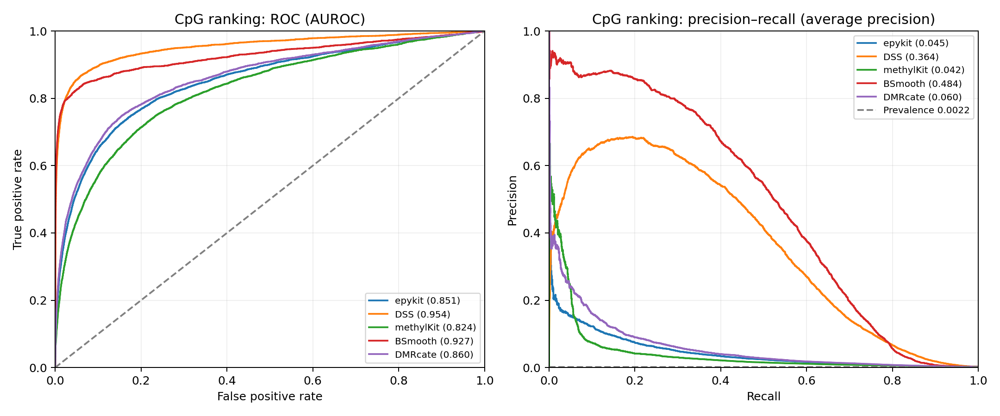

# Six-tool WGBS comparison: existing chr1–3 simulation

Follow-up: [health review, 30 September](health_review.md) checks calibration, boundary mismatches, execution warnings and changes from the original run.

## What this run establishes

This comparison uses the existing, unchanged simulation: 5,907,954 CpGs, 12,366 implanted positive CpGs. All tools share 2,656,784 covered CpGs, including 5,748 positives (0.216% prevalence). It is one simulated seed, not a general ranking of biological performance.

## Findings from this run

Among callers with discoveries, dmrseq has the highest observed region precision (89.6%); epykit has the highest region recall (35.1%). This describes the chosen operating thresholds on this seed, not an overall winner.

epykit has observed CpG false-discovery proportion 79.7% at its nominal 5% threshold. Nominal q-values are not demonstrated to be calibrated on this simulation; one realization cannot estimate repeated-run FDR.

DSS has observed CpG false-discovery proportion 83.5% at its nominal 5% threshold. Nominal q-values are not demonstrated to be calibrated on this simulation; one realization cannot estimate repeated-run FDR.

methylKit has observed CpG false-discovery proportion 89.6% at its nominal 5% threshold. Nominal q-values are not demonstrated to be calibrated on this simulation; one realization cannot estimate repeated-run FDR.

DMRcate returned zero significant regions. This is a completed analysis with no discoveries, not a failed run. Its native score ranking, where available, distinguishes limited threshold power from uninformative ranking.

BSmooth has the highest native CpG average precision in this run (0.4842), against a prevalence reference of 0.0022. This ranking metric does not measure region boundary accuracy.

The shared coverage filter retains 45.0% of all loci and 46.5% of implanted positive loci. Even perfect detection of eligible positives cannot exceed the latter percentage in full-truth CpG recall.

## Region recovery

A match requires at least 50% reciprocal overlap in common eligible CpGs and one-to-one matching. Recall uses all implanted regions, including regions lost to coverage filtering. methylKit calls fixed 1 kb windows; other methods call variable regions. Statistical thresholds differ across methods; 0.05 does not mean the same error guarantee for every caller.

| tool | status | dmr_matched_regions | dmr_called_regions | dmr_region_precision | dmr_region_recall | dmr_region_f1 | dmr_cpg_precision | dmr_cpg_recall_full_truth |
| --- | --- | --- | --- | --- | --- | --- | --- | --- |
| epykit | ok | 231 | 619 | 0.3732 | 0.3505 | 0.3615 | 0.5688 | 0.2331 |
| DSS | ok | 172 | 287 | 0.5993 | 0.261 | 0.3636 | 0.7642 | 0.2071 |
| methylKit | ok | 65 | 744 | 0.08737 | 0.09863 | 0.09266 | 0.2581 | 0.09227 |
| BSmooth | ok | 81 | 204 | 0.3971 | 0.1229 | 0.1877 | 0.8525 | 0.1416 |
| dmrseq | ok | 216 | 241 | 0.8963 | 0.3278 | 0.48 | 0.9431 | 0.2116 |
| DMRcate | ok | 0 | 0 | 0 | 0 | 0 | 0 | 0 |

## Stricter boundaries and direction

| tool | dmr_80_matched_regions | dmr_80_region_f1 | dmr_matched_direction_accuracy | dmr_start_boundary_mae_bp | dmr_end_boundary_mae_bp | dmr_fragmented_true_regions | dmr_merged_called_regions |
| --- | --- | --- | --- | --- | --- | --- | --- |
| epykit | 145 | 0.2269 | 1 | 220.9 | 178.2 | 18 | 1 |
| DSS | 80 | 0.1691 | 1 | 253.1 | 247.6 | 24 | 0 |
| methylKit | 22 | 0.03136 | 1 | 297.9 | 338 | 9 | 0 |
| BSmooth | 26 | 0.06025 | 1 | 373.2 | 332.1 | 41 | 0 |
| dmrseq | 72 | 0.16 | 1 | 287.4 | 251.4 | 1 | 0 |
| DMRcate | 0 | 0 | NA | NA | NA | 0 | 0 |

Boundary errors are calculated only for matched calls. Fragmentation and merging describe overlap relationships; they are not additional true positives.

## CpG detection at the reported threshold

| tool | dml_tp | dml_fp | dml_precision | dml_recall_eligible | dml_recall_full_truth | dml_false_discovery_proportion |
| --- | --- | --- | --- | --- | --- | --- |
| epykit | 91 | 357 | 0.2031 | 0.01583 | 0.007359 | 0.7969 |
| DSS | 3911 | 1.985e+04 | 0.1646 | 0.6804 | 0.3163 | 0.8354 |
| methylKit | 412 | 3536 | 0.1044 | 0.07168 | 0.03332 | 0.8956 |
| BSmooth | NA | NA | NA | NA | NA | NA |
| dmrseq | NA | NA | NA | NA | NA | NA |
| DMRcate | 0 | 0 | 0 | 0 | 0 | 0 |

These are native CpG tests with BH q ≤ 0.05 where available. BSmooth has a t statistic, without a calibrated CpG p-value. dmrseq tests candidate regions and does not provide native CpG tests.

## Ranking across thresholds

| tool | score_type | auroc | average_precision | n_returned | n_eligible |
| --- | --- | --- | --- | --- | --- |
| epykit | native CpG p-value | 0.8511 | 0.04497 | 2.657e+06 | 2.657e+06 |
| DSS | native CpG p-value | 0.9538 | 0.3639 | 2.657e+06 | 2.657e+06 |
| methylKit | native CpG p-value | 0.8241 | 0.04247 | 2.657e+06 | 2.657e+06 |
| BSmooth | absolute BSmooth t statistic (no p-value) | 0.927 | 0.4842 | 2.657e+06 | 2.657e+06 |
| DMRcate | native CpG p-value | 0.8597 | 0.06044 | 2.657e+06 | 2.657e+06 |

AUROC measures positive-versus-negative ranking. Average precision summarizes precision–recall and is especially informative with rare positives. Its random-ranking reference is the positive prevalence shown above. All eligible sites form the denominator; missing scores are tied last. BSmooth ranks absolute t statistics without inventing p-values. dmrseq is deliberately absent from this native CpG comparison. Region scores and CpG scores have different meanings; candidate-region scores are retained for inspection, not mislabeled as native CpG AUC.

## Runtime and memory

| tool | minutes | peak_RSS_GiB |
| --- | --- | --- |
| epykit | 1.117 | 1.929 |
| DSS | 8.692 | 4.833 |
| methylKit | 29.73 | 7.548 |
| BSmooth | 26.67 | 12.49 |
| dmrseq | 89.79 | 4.848 |
| DMRcate | 1.92 | 6.818 |

Runs are sequential with one worker and BLAS/OpenMP thread limits. Timings include input loading and caller output, but exclude Python scoring. RSS is sampled process-tree resident memory; shared pages can be counted more than once. Package versions are saved in each R session_info.txt.

## Runner choices and interpretation

- epykit: replicated likelihood-ratio test, empirical-Bayes dispersion, adaptive reference, BH correction; native chain merging.
- DSS: recommended WGBS smoothing over 500 bp, separate group dispersions, one core; global CpG BH; native callDMR defaults including p.threshold=1e-5.
- methylKit: MN overdispersion correction for biological replicates and BH; native 1 kb tiling, reported separately from adaptive regions.
- BSmooth: ns=70, h=1000, pooled variance for these independent synthetic groups, local correction; |t|≥4.6, at least three CpGs and absolute mean difference≥0.1. This is a heuristic region cutoff, not region FDR.
- dmrseq: group contrast, candidate difference 0.1, at least five CpGs, up to 100 permutations, q≤0.05; fixed random seed.
- DMRcate: native count transformation and methylation design, correct group coefficient, initial CpG FDR 0.05, lambda=1000, C=2; significant-region selection retained. Zero discoveries are valid output.

The documented choices are not claimed to be universally optimal. Previous exploratory pilot settings remain in separate folders; they are not selected by maximizing recovery on this seed.

## Dataset limitations and next interpretation

Coverage loss is substantial and caps full-truth recall. The existing generator drew sample library factors separately by chromosome, so requested 20× does not imply balanced sample depth. The dataset was intentionally retained for this requested comparison. Independent per-site biological variation does not reproduce all real WGBS spatial dependence, which can disadvantage smoothing-based callers. Calibration uses heterogeneous BLUEPRINT samples; its dispersion is not a tissue-matched replicate estimate. Poor results here do not establish that a package performs poorly on biological data.

The simulation is an adaptation of the DMRcate paper, not an exact reproduction. In Appendix A, the parameter vif multiplies the fitted mean-specific dispersion library; a multiplier of 1 does not mean absolute dispersion tau=1. Earlier wording suggesting fixed absolute tau should be disregarded.

To establish general performance, the next evidence needed is independent seeds, complete-null replicates, matched depth and dispersion scenarios, and a separately labeled paper-like or real-background source. A single seed cannot support confidence intervals across simulations.

## Reproduce and inspect

Run `bash run_reviewed_benchmark.sh`. Inputs: `data/chr1_3_full_baseline`. Exact run records: `manifest.json`; raw calls, scores, curves, logs and package versions: per-tool directories. `comparison.tsv` and `ranking.tsv` are the machine-readable tables. The original baseline results are preserved in `results/chr1_3_full_baseline`. Runner source snapshots and input metadata hashes are recorded alongside this report.
